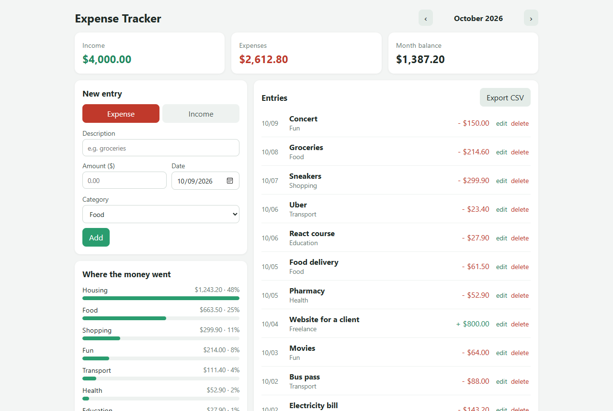
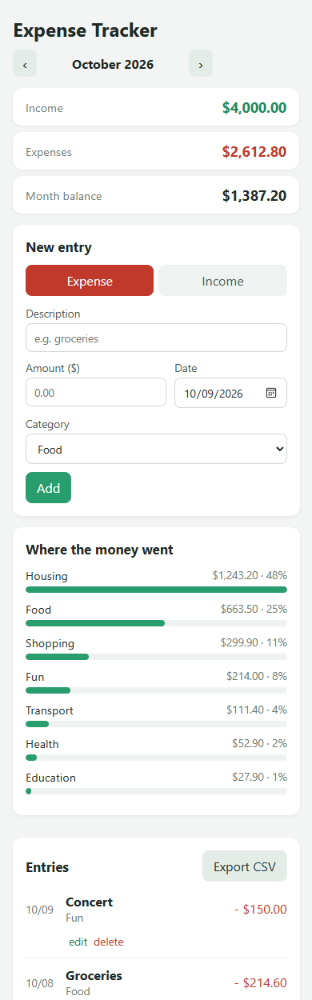
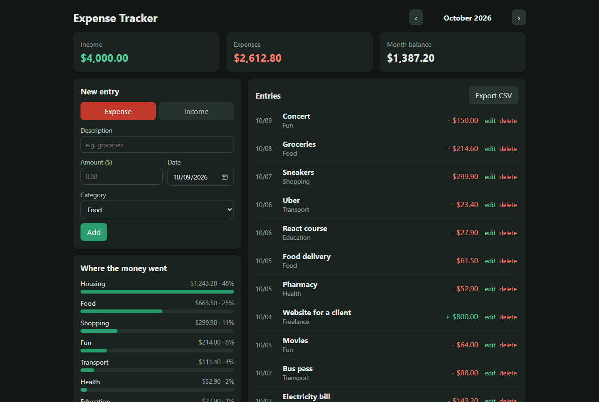

# Expense Tracker


An app to write down the month's income and expenses and see where the money is going. Built with React + Vite.

**Try it here:** https://viniciusclemos.github.io/expense-tracker/



I made it to practice React with an app I could actually use day to day. There's no login and no server: the data is saved in the browser itself (localStorage).

## What you can do

- add expenses and income with a category and a date
- edit and delete entries
- move between months
- see the month's total income, expenses and balance
- see expenses by category in a bar chart
- export the month to CSV (opens straight in Excel)
- install it on your phone as an app (Chrome shows "Add to home screen"), and it opens even without internet
- dark mode, which follows the phone or computer theme

The first time you open it, there's a button to load some sample data and see how it looks.

On the phone the layout turns into a single column, and in dark mode it looks like this:

<p>
  
  
</p>

## Running

```bash
git clone https://github.com/ViniciuscLemos/expense-tracker
cd expense-tracker
npm install
npm run dev
```

Tests:

```bash
npm test
```

## Some decisions

- Amounts are stored in cents (integers). With floats you get things like `0.1 + 0.2 = 0.30000000000000004`.
- You can type the amount as `25.90`, `1,234.56`, `1,500` or even `25,90` (for people used to a decimal comma).
- To make it installable I needed a `manifest.webmanifest` and a service worker (`public/sw.js`). The service worker always tries the network first and keeps a copy, so nobody gets stuck on an old version, and without internet it uses the copy.
- The site is published to GitHub Pages by a GitHub Action that runs the tests and builds it on every push.

## Structure

```
src/
  App.jsx           main state and saving
  components/       EntryForm, Summary, Chart, EntryList
  lib/finance.js    calculations (month summary, categories, csv...)
  lib/sample.js     sample data
```
