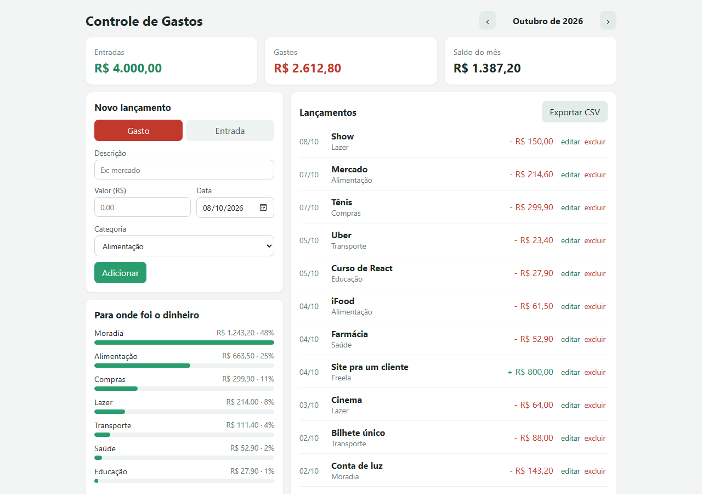
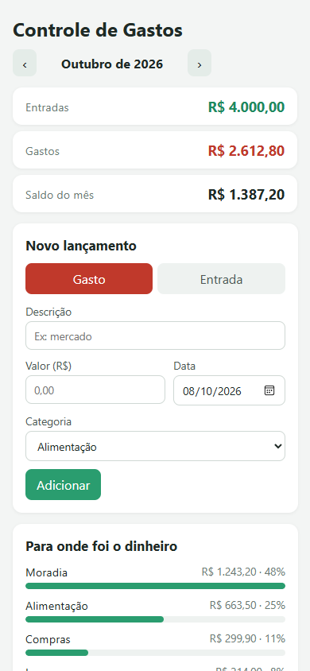

# Controle de Gastos

App pra anotar as entradas e os gastos do mês e ver pra onde o dinheiro está indo. Feito com React + Vite.

**Dá pra usar aqui:** https://viniciusclemos.github.io/controle-de-gastos/



Fiz pra praticar React com um app que dá pra usar no dia a dia. Não tem login nem servidor: os dados ficam salvos no próprio navegador (localStorage).

## O que dá pra fazer

- lançar gastos e entradas com categoria e data
- editar e excluir lançamentos
- navegar entre os meses
- ver o total de entradas, gastos e o saldo do mês
- ver os gastos por categoria num gráfico de barras
- exportar o mês em CSV (abre direto no Excel)

Se abrir pela primeira vez, tem um botão pra carregar uns dados de exemplo e ver como fica.

No celular o layout vira uma coluna só:



## Rodando

```bash
git clone https://github.com/ViniciuscLemos/controle-de-gastos
cd controle-de-gastos
npm install
npm run dev
```

Testes:

```bash
npm test
```

## Algumas decisões

- Os valores são guardados em centavos (número inteiro). Com `float` aparecem coisas tipo `0.1 + 0.2 = 0.30000000000000004`.
- Dá pra digitar o valor como `25,90`, `25.90`, `1.234,56` ou `1.500` (o ponto com 3 dígitos depois vira milhar).
- O CSV usa `;` como separador porque o Excel em português usa a vírgula nos decimais.
- O site é publicado no GitHub Pages por um GitHub Action que roda os testes e faz o build a cada push.

## Estrutura

```
src/
  App.jsx           estado principal e salvamento
  components/       Formulario, Resumo, Grafico, Lista
  lib/contas.js     cálculos (resumo do mês, categorias, csv...)
  lib/exemplo.js    dados de exemplo
```
